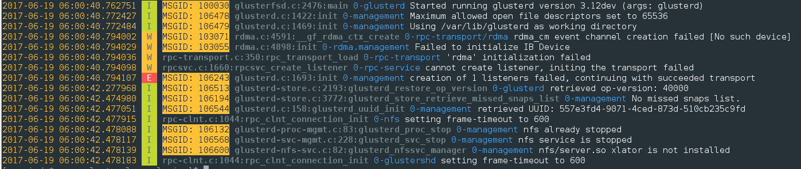

# gluster-log-colorize

A tool to colorize Gluster log files for easy read and debugging.

How easily can you spot a error message from below log lines

    [2017-06-19 06:00:40.762751] I [MSGID: 100030] [glusterfsd.c:2476:main] 0-glusterd: Started running glusterd version 3.12dev (args: glusterd)
    [2017-06-19 06:00:40.772427] I [MSGID: 106478] [glusterd.c:1422:init] 0-management: Maximum allowed open file descriptors set to 65536
    [2017-06-19 06:00:40.772484] I [MSGID: 106479] [glusterd.c:1469:init] 0-management: Using /var/lib/glusterd as working directory
    [2017-06-19 06:00:40.794002] W [MSGID: 103071] [rdma.c:4591:__gf_rdma_ctx_create] 0-rpc-transport/rdma: rdma_cm event channel creation failed [No such device]
    [2017-06-19 06:00:40.794029] W [MSGID: 103055] [rdma.c:4898:init] 0-rdma.management: Failed to initialize IB Device
    [2017-06-19 06:00:40.794036] W [rpc-transport.c:350:rpc_transport_load] 0-rpc-transport: 'rdma' initialization failed
    [2017-06-19 06:00:40.794098] W [rpcsvc.c:1660:rpcsvc_create_listener] 0-rpc-service: cannot create listener, initing the transport failed
    [2017-06-19 06:00:40.794107] E [MSGID: 106243] [glusterd.c:1693:init] 0-management: creation of 1 listeners failed, continuing with succeeded transport
    [2017-06-19 06:00:42.277968] I [MSGID: 106513] [glusterd-store.c:2193:glusterd_restore_op_version] 0-glusterd: retrieved op-version: 40000
    [2017-06-19 06:00:42.474980] I [MSGID: 106194] [glusterd-store.c:3772:glusterd_store_retrieve_missed_snaps_list] 0-management: No missed snaps list.
    [2017-06-19 06:00:42.477051] I [MSGID: 106544] [glusterd.c:158:glusterd_uuid_init] 0-management: retrieved UUID: 557e3fd4-9071-4ced-873d-510cb235c9fd
    [2017-06-19 06:00:42.477915] I [rpc-clnt.c:1044:rpc_clnt_connection_init] 0-nfs: setting frame-timeout to 600
    [2017-06-19 06:00:42.478088] I [MSGID: 106132] [glusterd-proc-mgmt.c:83:glusterd_proc_stop] 0-management: nfs already stopped
    [2017-06-19 06:00:42.478117] I [MSGID: 106568] [glusterd-svc-mgmt.c:228:glusterd_svc_stop] 0-management: nfs service is stopped
    [2017-06-19 06:00:42.478139] I [MSGID: 106600] [glusterd-nfs-svc.c:82:glusterd_nfssvc_manager] 0-management: nfs/server.so xlator is not installed
    [2017-06-19 06:00:42.478183] I [rpc-clnt.c:1044:rpc_clnt_connection_init] 0-glustershd: setting frame-timeout to 600

Compared to the screenshot below,

## Usage

    tail <any_gluster_log> | gluster-log-colorize

For example,

    tail /var/log/glusterfs/glusterd.log | gluster-log-colorize

Or convert full log file into a colorized log file and open with less for analyze.

    cat /var/log/glusterfs/glusterd.log | gluster-log-colorize > ~/glusterd_color.log

Then open using `less` command.

    less -R ~/glusterd_color.log

# Install

Not Ready Yet! Watch this space.
